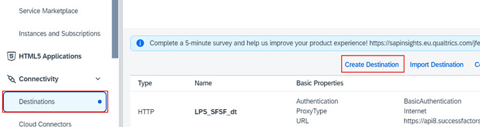
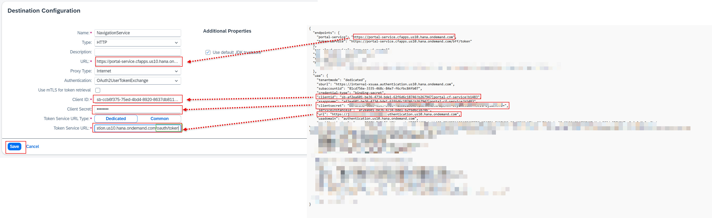

1. From the Navigation Pane on the left, select **Connectivity >> Destinations**.  Click **Create Destination**.

2. Specify the information below to create the destination and click **Save**:
  * Name: **NavigationService**
  * Type: **HTTP**
  * URL: <--**portal-service** url from the key file downloaded earlier-->
  * Proxy Type: **Internet**
  * Authentication: **OAuth2UserTokenExchange**
  * Token Service URL: <--**url** field from the key file downloaded earlier.  Make sure to add **/oauth/token** to end of the URL-->
  * Token Service URL Type: **Dedicated**
  * Client ID: <--**clientid** from key file downloaded earlier-->
  * Client Secret: <--**clientsecret** from key file downloaded earlier-->
  * Use default JDK truststore: **checked** 

