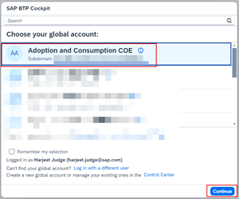

## **Create Subaccount and Cloud Foundry Space**

1. Access [BTP Cockpit URL](https://cockpit.btp.cloud.sap).
2. Select the BTP Global Account that has the Joule entitlements and click **Continue**.                        

3. From the Navigation Pane on the left, select **Account Explorer**.  Click **Create** >> **Subaccount**.  

4. Specify **Display Name** and **Region** and click **Create**.                               
   
**Note**: The **Region** must be from one of the supported data centers for Joule.  See [Data Centers Supported by Joule](https://help.sap.com/docs/JOULE/3fdd7b321eb24d1b9d40605dce822e84/8b4d8708f6d646a995fdc50f8c508f1f.html?version=CLOUD)

5. Click **Enable Cloud Foundry**.   

6. Leave the default settings and click **Create**.         

7. From the Navigation Pane, expand **Cloud Foundry** and click **Spaces**.                                                          

8. Click **Create Space**.                                                                                                                    

9. Specify a **Space Name** and click **Create**.                                       

## **Add Entitlements**

1. From the Navigation Pane, select **Entitlements** and click **Edit**. 

2. Click **Add Service Plans**.                         

3. Search for "Joule".  Click **Joule** and choose **foundation (Application)** from the list of available plans. 

4. Search for "workzone".  Click **SAP Build Work Zone, standard edition** and choose the **foundation** and **foundation (Application)** plans.  Click **Add 3 Service Plans**. 
**NOTE**: Use the **standard** and **standard (Application)** plan instead if you also want to setup Joule for SAP Build Work Zone.

5. Click **Save**.                 

## **Add Trusted Domains**

1. From the Navigation Pane, select **Settings** and click **Add**. 

2. Add your **SuccessFactors tenant URL** and click **Add**.  For example, https://hcm-us10.hr.cloud.sap.                  
**NOTE**:  Do not add trailing slash(/) at the end of the URL.     

3.  Click the **Add** button again to add URLs for additional applications (such as S/4AHANA Cloud Public Edition).

4. Similarly add URLs for other applications that will be setup for Joule.
 
