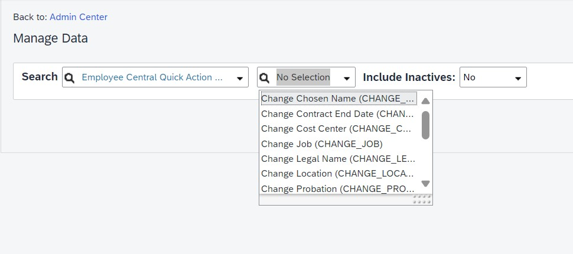
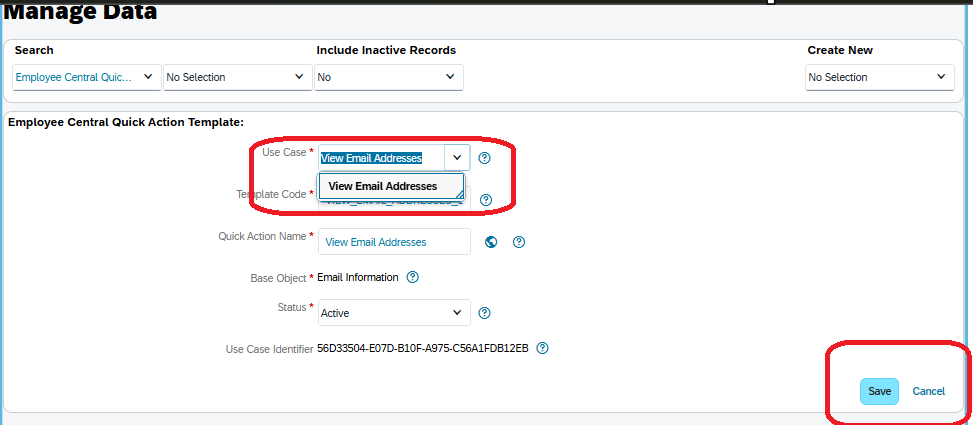
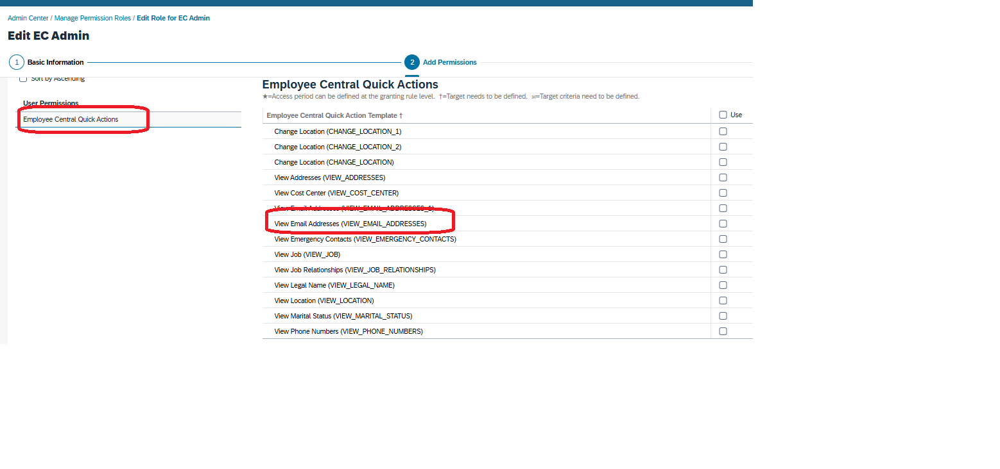

**NOTE**: Below steps are valid for Employee Central customers only.  You may skip this section if not testing the Employee Central specific use cases.
1. Go to **Admin Center >> Manage Permission Role**.
2. Under **Manage Business Configuration** >> **Employee Central Quick Action Template** enable the **Visibility** and **Actions** permissions. 

3. Save your changes.
4. Access **Admin Center** >> **Manage Data** and confirm **Employee Central Quick Action Template** objects are visible in the dropdown. 

5. If objects are not visible, then you can create the template objects by clicking on Create New and select Employee Central Quick Action Templates. 

   **Example**: I'm taking: **View My Email Addres** 

**Templates assignments to User**
Based on which use case's access you would like to assign to the user, you can control this via Role based permission
For example: To assign use case View Location, follow below steps:
1. Go to **Admin Center**-> **Manage Permission Role** and open User's role.
2. Navigate to **Employee Central Quick Actions** and select the use cse **View Location** as shown below: 

4. Save Changes.

**NOTE**: Above configuration should allow you to get the response with data while interacting with JOULE.
