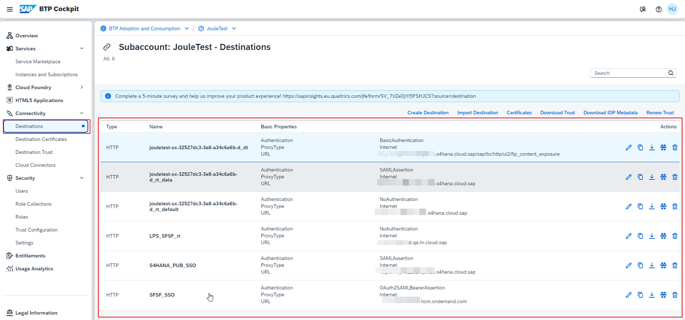

## Check Formations in BTP Global Account
1. If necessary, navigate to your BTP Global Account.
2. Under **System Landscape** click **Formations** and ensure the formation is created successfully.  The formations should have all the systems that were selected during the booster execution.  

## Check Joule Subscription and Destinations setup in BTP Subaccount
1. Click **Account Explorer** and select the Subaccount used for Joule setup. 
 
2. Click **Services -> Instances and Subscriptions** and confirm **Joule** application is subscribed successfully. 
  
3. Click on the **Joule** application, specify credentials of user in SAP Cloud Identity Services and click **Continue**. 
   
4. Confirm the Joule application is running and make a note of the URL of the application.  This URL is required later to complete Joule setup for certain SAP 
   applications like S/4HANA Cloud Public Edition. 
    
5. Click **Connectivity -> Destinations** and confirm the destinations are successfully created.  The destinations shown will vary based on the systems selected during the booster execution.  See screenshot below for relevant destinations if the booster was executed for S/4HANA Cloud Public Edition and SAP SuccessFactors. 
  

## Create NavigationService Destination
1. Click **Create Destination**. 

2. Specify the information below to create the destination and click **Save**:
  * Name: **NavigationService**
  * Type: **HTTP**
  * URL: <--**portal-service** url from the key file downloaded earlier-->
  * Proxy Type: **Internet**
  * Authentication: **OAuth2UserTokenExchange**
  * Token Service URL: <--**url** field from the key file downloaded earlier.  Make sure to add **/oauth/token** to end of the URL-->
  * Token Service URL Type: **Dedicated**
  * Client ID: <--**clientid** from key file downloaded earlier-->
  * Client Secret: <--**clientsecret** from key file downloaded earlier-->
  * Use default JDK truststore: **checked** 

## **Update application configuration in SAP Cloud Identity Authentication Service**
1. Access the administration console of SAP Cloud Identity Services tenant using one of the URL formats below:
  * https://your-ias-tenant.accounts.ondemand.com/admin
  * https://your-ias-tenant.accounts.cloud.sap/admin              
**Note**: Substitute your-ias-tenant with your actual tenant's name.

2. Authenticate using an administrator user.               

3. From the menu, access **Applications & Resource >> Applications**. 

4. Validate that both **das-ias** and **Document Grounding** applications are created in SAP Cloud Identity Services.  These are automatically created by the Joule booster.  Note that the application names will also include your subaccount name in brackets.

4. Select one of your application for which Joule is being setup for.  For eg. SuccessFactors and click on **Conditional Authentication**. 

5. Validate the **Conditional Authentication** settings for the application, but do not change anything in the existing setup.  The settings here would fall into one of the following 3 scenarios:
 * Scenario 1: Application is setup to use Identity Authentication as the Default Identity Provider
 * Scenario 2: Application is setup to use Identity Authentication as the Default Identity Provider but there are conditional rules setup to delegate authentication to a 3rd party corporate IDP
 * Scenario 3: 3rd party IDP is setup as the Default Identity Provider eg. OKTA in my screenshot below. 

6. Switch to **das-ias (Name of your subaccount)** application that is created by the booster. Set the **Conditional Authentication** settings for this application to match exactly what was set for the application for which Joule is being configured.  For eg. if the SuccessFactors application is setup with Scenario 3, you must also change Default Identity Provider in this application accordingly. 
**NOTE:** As mentioned in the preparations steps, if the same Joule instance is to be shared across multiple applications (eg SuccessFactors and S/4), then those applications must have the same conditional authentication settings.

## **Update Trusted Domains settings**

1. From the menu, access **Applications & Resource >> Tenant Settings**. 

2. Click **Customization** >> **Trusted Domains**. 

3. If necessary, click **Add** to add the domain of your application(s) and click **Save**.  For eg. if your SuccessFactors tenants URL is <--https://hcm-us10.hr.cloud.sap/login?company=yourcompany --> and S/4HANA Cloud Public Edition URL is <--https://myXXXXXXX.s4hana.cloud.sap --> the entry to add is ***.cloud.sap**.         

