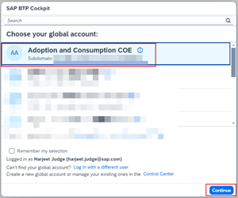
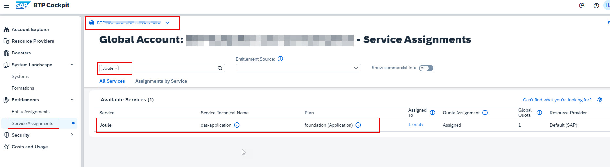
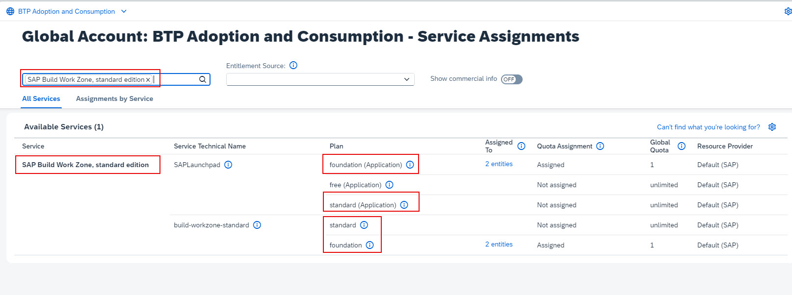
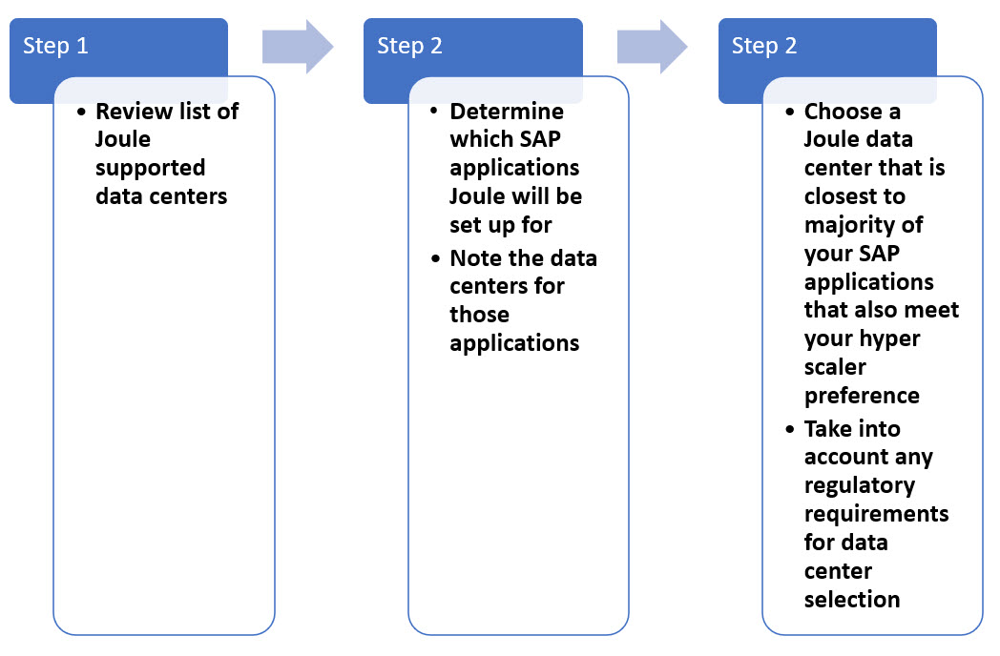
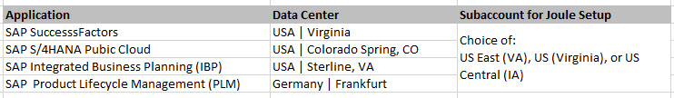
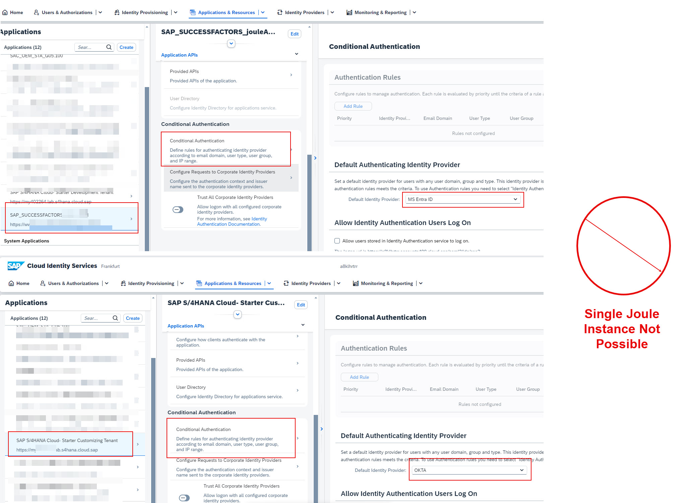
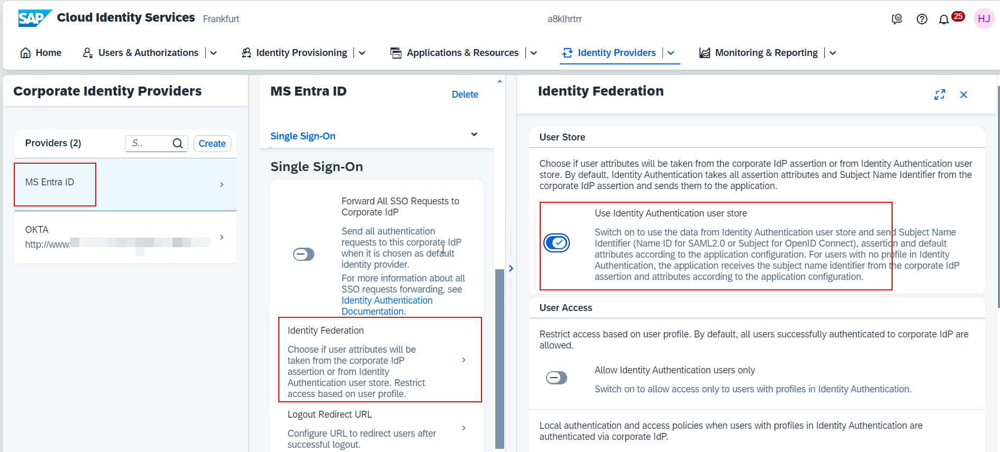
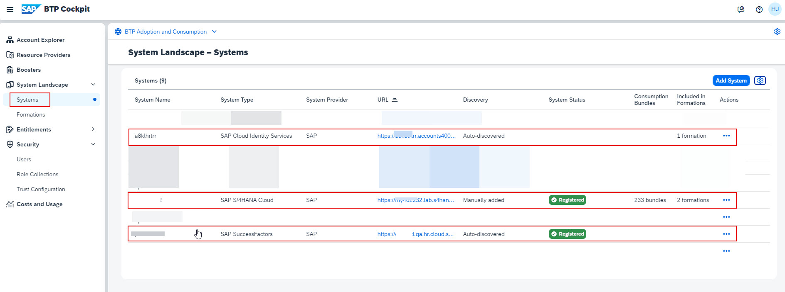

Before you can activate Joule, there are certain number of prerequisites that must be met.  This section describes those prerequisites and outlines some details that need to be captured prior to running through the activation steps.

## 1. User Personas Required for Joule activation

Activation of Joule requires configuration in multiple systems.  It's important to have the right stakeholders involved when setting up the configuration.  In order to set up Joule, the following user personas are required:
* Admins of the system for which Joule will be setup.  For example, SAP SuccessFactors, SAP S/4HANA Cloud Public Edition etc.
* SAP BTP Global Account Admin
* SAP Cloud Identity Services Admin
  
## 2. Verify Global Account Entitlements

1. Access [BTP Cockpit URL](https://cockpit.btp.cloud.sap).
2. Select the BTP Global Account and click Continue. 
   
3. From the Navigation Panel, expand **Entitlements** and click **Service Assignments**.
4. Search for **Joule** and validate that the following plan is available.
   
    | Application     | Technical Name | Plan        | Required Quota | Remaining Quota |
    | ----------- | ----------- | ----------- | -------------- | --------------- |
    | Joule      | das-application      | foundation       |     1            |          limited       |
  
    

5. Clear the existing search text and search for **SAP Build Work Zone, standard edition**.  Validate that the following 2 plans are available for SAP Build Work Zone:

    | Application     | Technical Name | Plan        | Required Quota | Remaining Quota |
    | ----------- | ----------- | ----------- | -------------- | --------------- |
    | SAP Build Work Zone, standard edition   | SAPLaunchpad       | foundation or standard       |      1           |       limited          |
    | SAP Build Work Zone, standard edition      | build-workzone-standard      | foundation or standard      |     1            |          limited       |
  
       

If the entitlements are not visible, it could be due to one of these reasons:
  * You don't have licenses for Joule.
  * Joule entitlements were added to a different BTP Global Account to which you don't have Global Account Admin access.
  * The start date for the Joule contract is at a future date hence the entitlements won't be visible in BTP until that date.

  In the scenarios above, please work with your Account Executive, BTP Customer Success Partner or SuccessFactors Customer Success Partner to resolve the entitlements issue prior to proceeding further with this mission.

## 3. Choose Data Center for Joule Setup

Joule is BTP Service that works with multiple SAP solutions.  The number of SAP solutions supported with Joule is growing on a regular basis so it's important to choose a data center for Joule setup that can work for various SAP systems that you may have in your landscape - even if those systems are not in scope for Joule setup now.  There are several factors that determine which data center to choose for Joule setup.  Some factors to consider: 
1) What are the currently supported datacenters for Joule? 
2) Which SAP solutions will Joule be set up for and what are datacenters of those solutions? 
3) Are there any legal requirements to choose a datacenter in a particular region? 
4) Do you have a preference for particular hyperscaler such AWS, Azure, Google etc.? 

The picture below depicts the process to follow to determine data center selection.
 

For Step 1, review the list of Joule supported data centers from the help page: [Data Centers Supported for Joule](https://help.sap.com/docs/JOULE/3fdd7b321eb24d1b9d40605dce822e84/8b4d8708f6d646a995fdc50f8c508f1f.html?version=CLOUD) 
Step 2 requires finding the data centers for the respective SAP systems for which Joule will be set up.  This will be different for each system so refer to solution specific documentation to find the respective data centers. 

Let's take a look at a hypthetical scenario shown in the picture below.  In this scenario, majority of the systems are in North American datacenters so it makes sense to choose one of the North American data centers for Joule setup.  The choice between US EAST (VA), US (Virginia), or US Central (IA) is entirely up to you based on your hyperscaler preference. 
 

## 4. Confirm same authentication setup used across SAP systems

To set up a Joule instance that works across different SAP systems, the following conditions must be met:
  * Systems must be integrated with the same SAP Cloud Identity Service tenant.
  * The trust setup between SAP Cloud Identity Authentication Service(IAS) and the SAP system should be using the same domain.
  * If using a Corporate Identity Provider, the Conditional Authentication settings for the applications must be set up the same way.

SAP provides a production and non-production instance of SAP Cloud Identity Services free of charge to SAP customers.  All non-production SAP systems should be integrated with same non-production Cloud Identity Services tenant and production ones with the production tenant.

SAP systems that are in scope for Joule setup must be integrated with SAP Cloud Identity Services using the same domain.  SAP Cloud Identity Services can use ondemand.com or cloud.sap domain hence it's important that systems that will use the same Joule instance have consistency on domain used to integrate with SAP Cloud Identity Services.  If that's not the case in your environment, then it's not possible to use a single Joule instance that works across different SAP systems.

Furthermore, if your SAP Cloud Identity Authentication Service is set up to use a Corporate Identity Provider, all of your applications must be configured to use the same Corporate Identity Provider.  For example, if you are planning to run the booster for SAP SuccessFactors and SAP S/4HANA Cloud Public Edition, the conditional authenticaton settings for both of these applications in SAP Cloud Identity Authenticaton Service should be setup the same way.  If that's not the case in your environment, then it's not possible to use a single Joule instance that works across different SAP systems.  The screenshot below depicts a scenario where SAP SuccessFactors is configured to use MS Entra ID while SAP S/4HANA Cloud Public Edition is setup to use OKTA.  In this scenario, the applicaitions conditional authentication settings do not match, hence unified Joule instance can't be used. 

## 5. Validate Identity Federation Settings in SAP Cloud Identity Services

In order for Joule to work, it requires certain attributes from the user profile in SAP Cloud Identity Services.  Specifically the Global User ID(GUID) field is used by the Joule application.  To ensure this attribute is read from SAP Cloud Identity Services user profile, the **Identity Federation** Settings may have to be enabled in your system.  This setting is relevant:
  * if you have a Corporate Identity Provider configured in SAP Cloud Identity Services
  * and your application is configured to delegate the authentication request to that corporate IDP

To enable this settings, ensure **Use Identity Authentication user store** toggle is enabled under the Identity Federation Settings of your Corporate Identity Provider setup in SAP Cloud Identity Services.  For more information on this setting, refer to [Configure Identity Federation](https://help.sap.com/docs/cloud-identity-services/cloud-identity-services/corp-idp-configure-identity-federation?version=Cloud&q=identity+Federation) 

## 6. SAP Cloud Identity Provisioning Service running on Neo or SAP Cloud Identity Services Landscape

Joule setup for different LOB solutions like SuccessFactors leverage SAP Cloud Identity Provisioning Service to read users from SuccessFactors and provision them to SAP Build Work Zone.  This requires that SAP Build Work Zone, standard edition is available as a connector under target systems in SAP Cloud Identity Provisioning Service (IPS).  This connector may not be available on IPS tenants running on NEO landscapes.  It's recommended customers migrate IPS from NEO to IPS running on SAP Cloud Identity Provisioning Service (SCI) landscape.  In most cases this migration can be done in a matter of minutes.  For more information on how to perform this migration, refer to the following links:
* [Blog: Go for your quick win! Migrate Identity Provisioning tenants to SAP Cloud Identity infrastructure](https://community.sap.com/t5/technology-blogs-by-sap/go-for-your-quick-win-migrate-identity-provisioning-tenants-to-sap-cloud/ba-p/13536739)
* [Help Documenation: Migrate Identity Provisioning Bundle Tenant](https://help.sap.com/docs/identity-provisioning/identity-provisioning/migrate-identity-provisioning-bundle-tenant)

## 7. Register Systems in SAP BTP

To set up Joule for SAP systems, it's important that those systems are registered under BTP **System Landscape**.  It's possible that the systems are already registered automatically or as part of another project.  If that's not the case, you may have to register the systems using the subsequent steps mentioned in this mission.  For the purpose of this mission I am using SAP SuccessFactors and SAP S/4HANA Cloud Public Edition to showcase the setup process.  Few things to note:
  * Register a new system only if it's not already there.
  * System Type of **SAP Cloud Identity Services** should already be listed by default.  Ensure that the SAP Cloud Identity Services tenant for the applications that are in scope for Joule setup is listed.
  * Not all systems have to be registered up front.  For example, if you are only going to run the booster for S/4HANA Cloud, there is no need to ensure that SuccessFactors is also registered under the System Landscape. 

