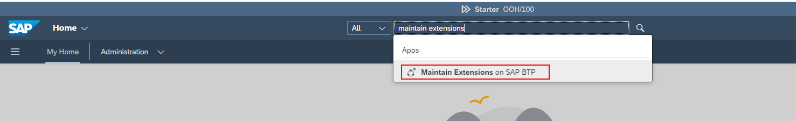

**NOTE**: Only execute the steps below if you don't have your S/4HANA Cloud Public Edition System registered already.  In most customer situations the system should already be registered under the BTP System Landscape.

1. Access [BTP Cockpit URL](https://cockpit.btp.cloud.sap).
2. Select the BTP Global Account that has the Joule entitlements and click **Continue**.                        

3. From the Navigation Pane on the left, select **System Landscape**.  

4. Click **Add System**.                               
5. Specify a **System Name** of your choice and select **SAP S/4HANA Cloud** from the **System Type** dropdown and click **Add**.   

6. Select **All Communication Scenarios** from the dropdown and click **Get Token**.         

7. Copy the **Registration Token** value and share it with your S/4HANA Cloud Public Edition Admin.  Close the token registration screen.                                                          

8. Log into S/4HANA Cloud Public Edition system as an admin user and search for **Maintain Extensions on SAP BTP** application.                                                                                                         

9. Click **New**.                                       

10. Paste the **Integration Token** copied earlier, specify a **Description** and click **Create**.                                                                                                                    

11. Click **Yes** to approve the system registration.                                                                                                                    

12. Confirm the Status is **Enabled**.

13. Confirm the status is updated to **Registered** in the BTP Cockpit.                                                                                                                    

**Note**: You may have to refresh the BTP Cockpit browser session to see the updated status.
