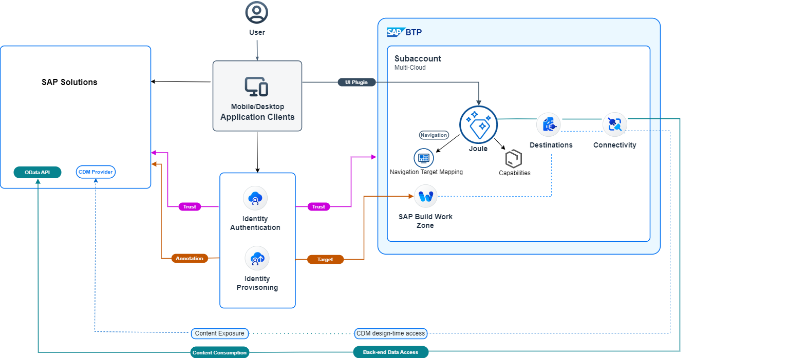

Joule is the AI copilot that truly understands your business. Joule revolutionizes how you interact with your SAP business systems, making every touch-point count and every task simpler.

It enables the companion of the Intelligent Enterprise, guiding you through content discovery within the SAP Ecosystem, and giving a transparent role-based access to the relevant processes from everywhere. This is the one assistant experience, a unified and delightful user experience across SAP’s solution portfolio.

Joule offers conversational interactions between humans and computers to simplify access to information and automate business processes, thus improving both the employee and customer satisfaction. Joule can direct you to the right application to complete your tasks, help you to complete certain tasks, and find the information you're looking for quickly and easily.

Joule is a BTP service that can be hosted in multiple environments and data centers:  Refer to [Data Centers Supported for Joule](https://help.sap.com/docs/JOULE/3fdd7b321eb24d1b9d40605dce822e84/8b4d8708f6d646a995fdc50f8c508f1f.html?version=CLOUD).

Additional Resources: 
[Joule Help Guide](https://help.sap.com/docs/JOULE/6189c8655c484916bb8eb767126a653a/702f3db8996a4a5bbceb6abd33c3ec69.html) 
[Joule and additional AI Innovations from SAP](https://www.sap.com/canada/products/artificial-intelligence/ai-assistant.html)

The setup process for Joule with SAP applications requires integration across multiple SAP components as depicted in the picture below.  This purpose of this guide is to provide step-by-step instructions on how to set up a unified Joule instance that can work across multiple SAP solutions.  In this mission I will primarily focus on Joule configuration in the SAP BTP environment while other solution-specific-configuration is covered in separate missions.  Support for additional SAP solutions is being added on a regular basis so make sure to check the links above for updates. 

